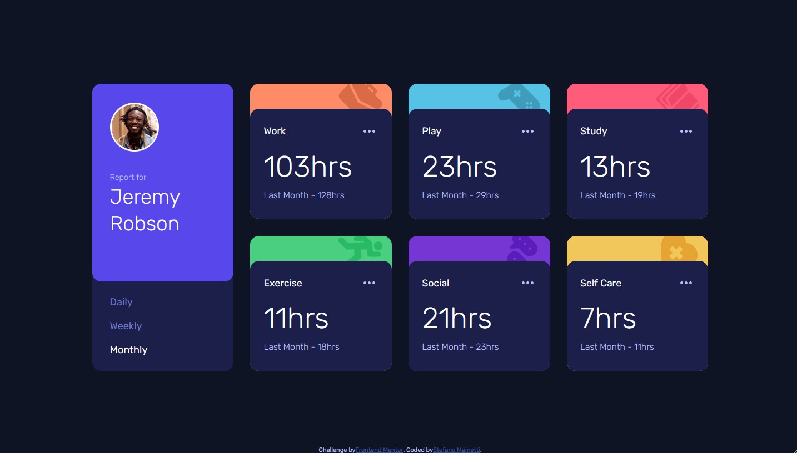

# Frontend Mentor - Time tracking dashboard solution

This is a solution to the [Time tracking dashboard challenge on Frontend Mentor](https://www.frontendmentor.io/challenges/time-tracking-dashboard-UIQ7167Jw). Frontend Mentor challenges help you improve your coding skills by building realistic projects.

## Table of contents

- [Overview](#overview)
  - [The challenge](#the-challenge)
  - [Screenshot](#screenshot)
  - [Links](#links)
- [My process](#my-process)
  - [Built with](#built-with)
  - [What I learned](#what-i-learned)
  - [Continued development](#continued-development)
  - [Useful resources](#useful-resources)
- [Author](#author)

## Overview

### The challenge

Users should be able to:

- View the optimal layout for the site depending on their device's screen size
- See hover states for all interactive elements on the page
- Switch between viewing Daily, Weekly, and Monthly stats

### Screenshot

### Links

- Solution URL: [Add solution URL here](https://github.com/stefanomainetti/time-tracking-dashboard)
- Live Site URL: [Add live site URL here](https://stefanomainetti.github.io/time-tracking-dashboard/)

## My process

### Built with

- Semantic HTML5 markup
- CSS custom properties
- Mobile-first workflow
- [SASS](https://sass-lang.com/) - for styles

### What I learned

In this challenge I very much concentrated on accessibility aspects trying to figure out the optimal HTML tags and ARIA attributes.
Not sure if that is working since I've just used the Windows screen reader which is not behaving as I would have expected.
Keyboard navigation seems to work properly.

### Continued development

My plan is now to move to higher level challeges to test my skills while keeping respect of accessibility standards as one of the main goals in setting up the HTML semantics.

### Useful resources

- [a11y Project](https://www.a11yproject.com/) - Incredibly useful to get in touch with accessibility aspects and run a self audit on the code

## Author

- Frontend Mentor - [@stefanomainetti](https://www.frontendmentor.io/profile/stefanomainetti)
